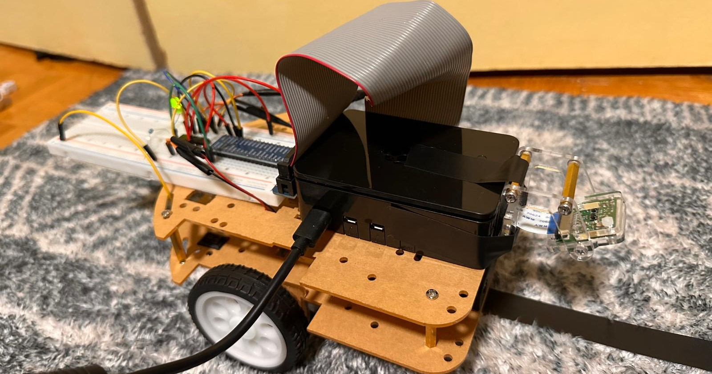

#Path-following Robocar Project

## Overview
The Robocar project is designed to create an autonomous vehicle that can navigate using computer vision techniques. The project utilizes a camera to detect black lines on the ground and adjusts the motor speeds accordingly to follow the path.



## Installation
1. Clone the repository:
   ```
   git clone https://github.com/yourusername/robocar.git
   ```
2. Navigate to the project directory:
   ```
   cd robocar
   ```
3. Install the required packages:
   ```
   pip install -r requirements.txt
   ```

## Usage
To run the Robocar, execute the following command:
```
python src/main.py
```

## Hardware Setup
Refer to the `docs/hardware_setup.md` file for detailed instructions on setting up the hardware components.


## How It Works
The Robocar uses a simple but effective approach to follow lines:

### Image Processing
The system captures video frames from the camera and processes them to detect black lines:
1. A region of interest (ROI) is defined in the lower portion of the image
2. Color thresholding isolates black lines from the background
3. Morphological operations (erosion and dilation) clean up the binary image
4. Contour detection finds the shape of the line
5. The center point of the detected line is calculated

### Line Following Logic
The robot follows the line using a control system:
1. An error value is calculated as the difference between the line's position and the center of the frame
2. The `direction()` function determines appropriate motor speeds based on the error:
   - Small error: Both motors run at full speed
   - Moderate error: One motor slows down to correct course
   - Large error: One motor stops while the other continues
   - Extreme error: Both motors stop (line lost)
3. The differential in motor speeds causes the robot to turn toward the line

### Control Flow
1. Main loop captures frames continuously
2. Each frame is processed to find the line position
3. Motor speeds are adjusted in real-time based on the line position
4. Visual feedback is provided through OpenCV windows

## Demo
[<video src='https://youtu.be/oZ3vJQsgQos' width=180/>](https://youtu.be/oZ3vJQsgQos)

## License
This project is licensed under the MIT License. See the LICENSE file for details.
